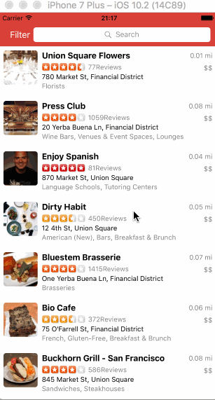

# Project 2 - *Tiny Yelp*

**Tiny Yelp** is a Yelp search app using the [Yelp API](http://www.yelp.com/developers/documentation/v2/search_api).

Time spent: **25** hours spent in total

## User Stories

The following **required** functionality is completed:

- [x] Search results page
   - [x] Table rows should be dynamic height according to the content height.
   - [x] Custom cells should have the proper Auto Layout constraints.
   - [x] Search bar should be in the navigation bar (doesn't have to expand to show location like the real Yelp app does).
- [x] Filter page. Unfortunately, not all the filters are supported in the Yelp API.
   - [x] The filters you should actually have are: category, sort (best match, distance, highest rated), distance, deals (on/off).
   - [x] The filters table should be organized into sections as in the mock.
   - [x] You can use the default UISwitch for on/off states.
   - [x] Clicking on the "Search" button should dismiss the filters page and trigger the search w/ the new filter settings.

The following **optional** features are implemented:

- [x] Search results page
   - [x] Infinite scroll for restaurant results.
   - [ ] Implement map view of restaurant results.
- [x] Filter page
   - [x] Implement a custom switch instead of the default UISwitch.
   - [x] Distance filter should expand as in the real Yelp app
   - [x] Categories should show a subset of the full list with a "See All" row to expand. Category list is [here](http://www.yelp.com/developers/documentation/category_list).
- [ ] Implement the restaurant detail page.

The following **additional** features are implemented:

- [ ] List anything else that you can get done to improve the app functionality!

Please list two areas of the assignment you'd like to **discuss further with your peers** during the next class (examples include better ways to implement something, how to extend your app in certain ways, etc):

1.Add custom thrumb image to custom switch class. I'm using "thumbTintColor = UIColor.init(patternImage: thumbImage!)", but it actually cut part of my custom thrum image off and requires specific size of image. Looking for a better way to implement this.
2.Implement map view of restaurant results. I don't have time to implement this optional feature this weekend, but I'm interested in this one.

## Video Walkthrough

Here's a walkthrough of implemented user stories:

GIF created with [LiceCap](http://www.cockos.com/licecap/).

## Notes

Describe any challenges encountered while building the app.
1. Yelp API has a tricky bug with filtering by distance: https://github.com/Yelp/yelp-api/issues/95. And the rating sort is not strictly sorted by the rating value, but by an adjusted rating value that takes into account the number of ratings, similar to a bayesian average. I thought something wrong with my filters at first and it took me a while to realize it's something with the API.

2. Add custom thrumb image to UISwitch.

3. To implement infinite scrolling, we only need to change offset. I thought we need both limit and offset parameters.

## License

    Copyright [2017] [Mandy Chen]

    Licensed under the Apache License, Version 2.0 (the "License");
    you may not use this file except in compliance with the License.
    You may obtain a copy of the License at

        http://www.apache.org/licenses/LICENSE-2.0

    Unless required by applicable law or agreed to in writing, software
    distributed under the License is distributed on an "AS IS" BASIS,
    WITHOUT WARRANTIES OR CONDITIONS OF ANY KIND, either express or implied.
    See the License for the specific language governing permissions and
    limitations under the License.
